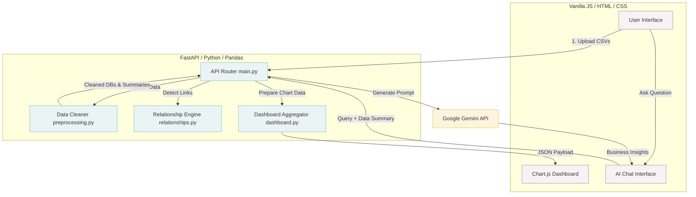

<div align="center">
  
  
  

  <h1>📊 Project Data Analyst</h1>
  <p><strong>A Full-Stack Data Analytics Platform Powered by AI</strong></p>

  <p>
    <a href="#features">Features</a> •
    <a href="#applications">Applications</a> •
    <a href="#architecture">Architecture</a> •
    <a href="#setup--installation">Installation</a> •
    <a href="#how-it-works-algorithms--logic">How it Works</a> •
    <a href="#contributing">Contributing</a>
  </p>
</div>

---

## 📖 Introduction

**Project Data Analyst** is an open-source, full-stack web application designed to act as your personal AI data scientist. It empowers users—from business managers to individual researchers—to easily transform raw CSV data into actionable, strategic insights without writing a single line of code.

By combining the powerful data manipulation capabilities of **Python (Pandas)** with the interactive visualization of **JavaScript (Chart.js)** and the advanced reasoning of **Google's Gemini AI**, this tool automatically cleans your data, detects complex relationships across multiple files, generates dynamic dashboards, and provides human-readable business recommendations.

## ✨ Features

- 🧹 **Automated Data Cleaning**: Upload messy CSV files, and the system automatically removes duplicates, handles missing values, and infers correct data types.
- 🔗 **Intelligent Relationship Detection**: Upload multiple tables (e.g., `Customers.csv` and `Orders.csv`), and the app will automatically figure out how they connect (1:1, 1:N, M:N relationships).
- 📈 **Interactive Dashboards**: Instantly visualizes your aggregated data via dynamic, responsive charts (Bar, Line, Pie) and KPI summary cards.
- 🤖 **AI-Powered Insights**: Integrates with the Google Gemini API to "read" your data summaries and provide strategic business recommendations or answer specific queries about your datasets.
- ⚡ **Lightweight & Fast**: Built with FastAPI for high-performance backend processing and Vanilla JavaScript for a snappy frontend experience (no heavy framework bundles).

## 💡 Applications

This project is highly versatile and can be implemented in various scenarios:

1. **Business Intelligence (BI) for SMEs**: Small businesses can upload their sales and inventory data to quickly understand trends, top-selling products, and revenue growth without buying expensive BI tools.
2. **Academic Research**: Researchers can upload experimental data to rapidly generate descriptive statistics and preliminary visualizations to guide their analyses.
3. **Marketing Analytics**: Marketing teams can merge customer data with campaign performance data to ask the AI, "Which demographic responds best to our email campaigns?"
4. **Portfolio Project Generation**: Developers can fork this repository to build domain-specific analytics tools (e.g., HR Analytics, Real Estate Analytics) to showcase in their portfolios.

---

## 🏗️ Architecture

Below is a high-level flowchart detailing how data moves through the application.



---

## 🛠️ How It Works: Algorithms & Logic

Understanding the core modules will help you customize the project for your own needs.

### 1. Data Preprocessing (`backend/services/preprocessing.py`)
- **Algorithm**: The backend leverages Pandas DataFrames.
- **Workflow**: 
  1. Drops exact duplicate rows.
  2. Imputes missing numeric values with the column mean and categorical strings with `"Unknown"`.
  3. Uses robust regex and Pandas' `to_datetime` and `to_numeric` to strongly type columns, ensuring downstream sorting and charting work correctly.
- **Output**: Returns a cleaned DataFrame and a heavily compressed JSON "summary" (count, min, max, unique values) to safely pass to the AI.

### 2. Relationship Detection (`backend/services/relationships.py`)
- **Algorithm**: Heuristic-based schema matching.
- **Workflow**: It iterates through pairs of uploaded tables. It looks for identical column names (e.g., `customer_id` in `Users.csv` and `Orders.csv`).
- **Logic**: It determines the relationship type by checking uniqueness:
  - **1:1**: The column is fully unique in *both* tables.
  - **1:N**: The column is unique in Table A, but has duplicates in Table B.
  - **M:N**: The column has duplicates in *both* tables.

### 3. Dashboard Aggregation (`backend/services/dashboard.py`)
- **Algorithm**: Group-by and Aggregation logic.
- **Workflow**: Identifies "numeric" columns (metrics like Revenue) and "categorical" columns (dimensions like Region or Category).
- **Logic**: It dynamically creates grouped datasets (e.g., `df.groupby('Region')['Revenue'].sum()`) depending on the exact schema uploaded, formatting the output into a structure Chart.js native expects (`labels: [], datasets: []`).

### 4. AI Insights (`backend/services/gemini_client.py`)
- **Algorithm**: Large Language Model (LLM) Prompt Engineering.
- **Workflow**: Appends the highly compressed data summaries (generated in step 1) alongside a strict system prompt instructing Gemini to act as a senior data analyst. This prevents sending massive raw CSVs over the network, saving tokens and ensuring security while still providing deep insights.

---

## 🚀 Setup & Installation

Follow these instructions to run the project locally.

### Prerequisites
- Python 3.8+
- A Google Gemini API Key. Get one for free at [Google AI Studio](https://aistudio.google.com/).

### 1. Clone the Repository
```bash
git clone https://github.com/your-username/Project-Data-Analyst.git
cd Project-Data-Analyst
```

### 2. Set Up a Virtual Environment (Recommended)
```bash
python -m venv .venv
source .venv/bin/activate  # On Windows use: .venv\Scripts\activate
```

### 3. Install Dependencies
```bash
pip install -r requirements.txt
```

### 4. Configure Environment Variables
Create a file named `.env` in the root directory of the project and add your API key:
```env
GEMINI_API_KEY="your_google_gemini_api_key_here"
```

### 5. Run the Application
Start the FastAPI server:
```bash
uvicorn backend.main:app --reload
```
Open your web browser and navigate to: **`http://localhost:8000`**

---

## 🤝 Contributing

This is an open-source project, and contributions are heavily encouraged! Whether you are a beginner looking to make your first PR or an experienced developer adding complex features, you are welcome here.

**How to contribute:**
1. Fork the repository.
2. Create your feature branch (`git checkout -b feature/AmazingFeature`).
3. Commit your changes (`git commit -m 'Add some AmazingFeature'`).
4. Push to the branch (`git push origin feature/AmazingFeature`).
5. Open a Pull Request.

**Ideas for future features:**
- Export dashboard to PDF.
- Add support for connecting directly to SQL databases (PostgreSQL/MySQL).
- Implement user authentication and saved sessions.

---

<div align="center">
  <p>Built with ❤️ for Data Enthusiasts</p>
</div>